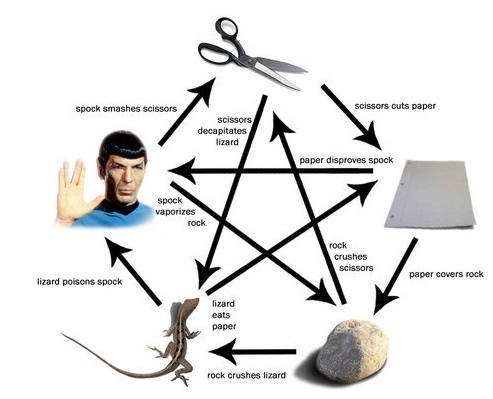

# JokenpoAPI



> A API cadastra jogadores e suas ações e calcula o vencedor da partida.

## 💻 Pré-requisitos

- Python

## 🚀 Instalação

Windows:

- Clone o repositório e o acesse

- Crie um ambiente virtual e o ative

```
virtualenv venv
.\venv\scripts\activate
```

- Instale as dependências via pip

```
pip install -r requirements.txt
```

## ☕ Inicializar

```
flask run
```

## 📫 Endpoints

## ✅ Criar jogador

```
curl --location --request POST 'http://localhost:5000/api/players' \
--header 'Content-Type: application/json' \
--data-raw '{
	"name" : "Jogador 1"
}'
```

Resposta

```
"Player": {
    "name": "Jogador 1"
}
```

## ✅ Listar jogadores

```
curl --location --request GET 'http://localhost:5000/api/players'
```

Resposta

```
{
    "Players": [
        {
            "name": "Jogador 1"
        },
        {
            "name": "Jogador 2"
        }
    ]
}
```

## ✅ Listar jogador pelo nome

```
curl --location --request GET 'http://localhost:5000/api/players/Jogador%201'
```

Resposta

```
{
    "Player": [
        {
            "name": "Jogador 1"
        }
    ]
}
```

## ✅ Remover jogador

```
curl --location --request DELETE 'http://localhost:5000/api/players/Jogador%202'
```

Resposta

```
Status: 204 NO CONTENT
```

## ☑️ Criar jogada

```
curl --location --request POST 'http://localhost:5000/api/actions' \
--header 'Content-Type: application/json' \
--data-raw '{
	"name" : "Jogador 1",
    "action": "Pedra"
}'
```

Resposta

```
"Action": {
    "name": "Jogador 1",
    "action: "Pedra"
}
```

## ☑️ Listar jogadas

```
curl --location --request GET 'http://localhost:5000/api/actions'
```

Resposta

```
{
    "Actions": [
        {
            "name": "Jogador 1",
            "action": "Pedra"
        },
        {
            "name": "Jogador 2",
            "action": "Papel"
        }
    ]
}
```

## ☑️ Lista jogada de um jogador

```
curl --location --request GET 'http://localhost:5000/api/actions/Jogador%201'
```

Resposta

```
{
    "Action": [
        {
            "name": "Jogador 1",
            "action": "Pedra"
        }
    ]
}
```

## ☑️ Remove jogada

```
curl --location --request DELETE 'http://localhost:5000/api/actions/Jogador%202'
```

Resposta

```
Status: 204 NO CONTENT
```

## 🎮 Jogar

```
curl --location --request GET 'http://localhost:5000/api/game'
```

- Jogadas

```
{
    "Actions": [
        {
            "action": "Papel",
            "name": "Jogador 1"
        },
        {
            "action": "Pedra",
            "name": "Jogador 3"
        }
    ]
}
```

Resposta

```
{
    "Action": "Papel",
    "Winners": [
        "Jogador 1"
    ]
}
```

## 📚 Testes

Utilize

```
pytest
```
